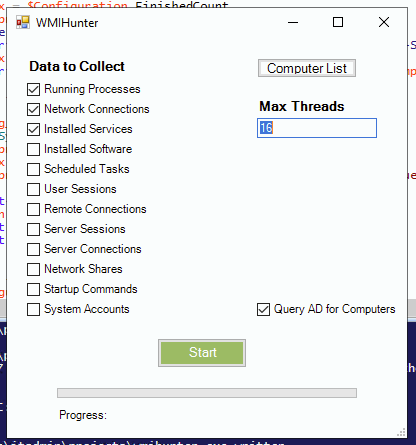

# Windows Management Instrumentation Hunter
Utilize WMI via PowerShell to retrieve and filter information from remote hosts for IR/Hunting purposes.

Data is saved to individual CSV files for each specified data source in the same folder that the script is run from.

WMIHunter requires Remote WMI Query permissions for use - typically granted by default to any Local Admin but is also possible through other rights assignments [https://serverfault.com/questions/28520/which-permissions-rights-does-a-user-need-to-have-wmi-access-on-remote-machines]

Screenshot of Optional GUI



Progress Bar During Execution


Progress Bar when Complete


```
# ARGUMENTS
-gui = Launch with GUI
-max_threads = Maximum threads to utilize for asynchronous operations (Optional)
-computers_file = Location of Text File containing line-delimited hostnames for querying. (Optional)
-data_types = Array of Data Types to Retrieve
-ip_addresses = Array of IP Addresses to Filter on #TODO
-process_names = Array of Process Names to Filter on #TODO
-service_names = Array of Service Names to Filter on #TODO

.\wmih.ps1 -gui - Launch with optional GUI - will eventually ignore all command-line parameters
.\wmih.ps1 - Will execute with default parameters (16 threads, all data collection enabled, ADSI Searcher to find Computer Users, No IOC filtering)
.\wmih.ps1 -max_threads 20 - Launch with default parameters but increase or decrease the max threads used in the Runspace CreateRunspacePool
.\wmih.ps1 -data_types processes,connections - Only retrieve running processes and network connections
.\wmih.ps1 -computers_file 'C:\file.txt' - Supply a line-delimited list of hostnames for use in querying rather than using an ADSI searcher
.\wmih.ps1 -ips 10.10.10.10,192.168.0.1 - Supply an array of IP Addresses that will be used to filter for specific Remote Connections
```
### AVAILABLE DATA TYPES
* processes - Retrieves information about running processes.
* connections - Retrieves information about TCP connections.
* services - Retrieves information about installed services.
* software - Retrieves information about installed software.
* tasks - Retrieved information about scheduled tasks.
* logons - Retrieves information about currently logged-on users.
* remote_cons - Retrieves information about active network connections.
* serv_sessions - Retrieves information about sessions established from remote computers.
* serv_connections - Retrieves information about remote connections to local shared resources.
* network_shares - Retrieves information about shared resources.
* startups - Retrieves information about commands run automatically at user logon.
* sys_accounts - Retrieves information about system accounts.

## TODO
* WMI Connection Test on Host and Skip All Queries if Unresponsive
* Refactor Code to split out functionality better
* Data Filtering at Commandline, GUI
* Improving GUI Look
* Icon
* Additional Commandline Specifications
* Additional WMI Queries/Data Types 
* ?
