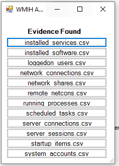
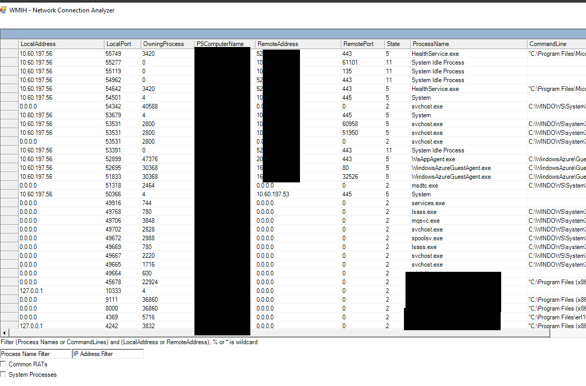

# Windows Management Instrumentation Hunter

A PowerShell script utilizing asynchronous WMI queries to retrieve forensically useful information from remote hosts.

## How does it work?

A list of computers is provided to the program or dynamically gathered from Active Directory using an ADSISearcher.

Data Sources are either selected in the GUI, at command-line or if none are specified, all are queried for (see Available Data Types below).

For each detected hostname, a job is created in a PowerShell RunSpacePool which will operate asynchronously using the specified maximum threads - each job gathers remote data and appends it to the appropriate main CSV.

## Requirements

WMIHunter does not utilize WinRM/WSMAN but instead requires DCOM protocol and Remote WMI Query permissions for use - typically granted by default to any Local Admin but is also possible through other rights assignments [https://serverfault.com/questions/28520/which-permissions-rights-does-a-user-need-to-have-wmi-access-on-remote-machines]

This is a design decision since often WinRM is not often enabled on workstations/laptops and is often disabled on servers in favor of other management utilities/applications, especially in larger networks.  DCOM is often enabled and available for remote communications on both servers and endpoints.  
### Instructions for Usage

- Option A: Run with All Components across all Domain Computers
```
powershell iex ((New-Object System.Net.WebClient).DownloadString('https://raw.githubusercontent.com/joeavanzato/WMIHunter/main/WMIHunter.ps1'))
```

Option B
1. Clone/Download the Repository [git clone https://github.com/joeavanzato/WMIHunter]
2. cd WMIHunter && powershell.exe .\wmihunter.ps1 -gui
3. Select Data Types to Retrieve - some can take longer than others.
4. If using a pre-specified list of Computers, select the file using 'Computer List', otherwise no action needed.
5. Specify Max Threads depending on CPU - an 8-core CPU typically has 16 threads available for use - 2 per core.  Adjust accordingly.
6. Click Start - once results are retrieved, it is possible to hit 'Analyze' to launch the sub-script for analyzing data which will present a GUI based on collected evidence
7. Select buttons from Analyzer menu to open up data analysis/exploration windows for that particular piece of evidence.

```
# ARGUMENTS
-gui = Launch with GUI
-max_threads = Maximum threads to utilize for asynchronous operations (Optional)
-computers_file = Location of Text File containing line-delimited hostnames for querying. (Optional)
-data_types = Array of Data Types to Retrieve
-ip_addresses = Array of IP Addresses to Filter on #TODO
-process_names = Array of Process Names to Filter on #TODO
-service_names = Array of Service Names to Filter on #TODO

.\wmihunter.ps1 -gui - Launch with optional GUI - will eventually ignore all command-line parameters
.\wmihunter.ps1 - Will execute with default parameters (16 threads, all data collection enabled, ADSI Searcher to find Computer Users, No IOC filtering)
.\wmihunter.ps1 -max_threads 20 - Launch with default parameters but increase or decrease the max threads used in the Runspace CreateRunspacePool
.\wmihunter.ps1 -data_types processes,connections - Only retrieve running processes and network connections
.\wmihunter.ps1 -computers_file 'C:\file.txt' - Supply a line-delimited list of hostnames for use in querying rather than using an ADSI searcher
.\wmihunter.ps1 -ips 10.10.10.10,192.168.0.1 - Supply an array of IP Addresses that will be used to filter for specific Remote Connections
```
### AVAILABLE DATA TYPES
* processes - Retrieves information about running processes.
* connections - Retrieves information about TCP connections.
* services - Retrieves information about installed services.
* software - Retrieves information about installed software.
* tasks - Retrieved information about scheduled tasks.
* logons - Retrieves information about currently logged-on users.
* remote_cons - Retrieves information about active network connections.
* serv_sessions - Retrieves information about sessions established from remote computers.
* serv_connections - Retrieves information about remote connections to local shared resources.
* network_shares - Retrieves information about shared resources.
* startups - Retrieves information about commands run automatically at user logon.
* sys_accounts - Retrieves information about system accounts.

Screenshot of Optional GUI


Progress Bar During Execution


Progress Bar when Complete


## Why make this?

Good question - often times I found myself needing to hunt across an environment for a specific indicator - Process Names, Remote Addresses, Service Names, User Accounts, etc.

Many of these investigations took place in low-maturity environments that did not have the capacity, support or logistics in-place to allow forwarding and searching of critical information from servers, endpoints, firewalls, Domain Controllers etc (tsk tsk).

As such, I had a need to rapidly search an environment through readily-available mechanisms - WinRM is great for establishing PowerShell sessions with two major draw-backs - organizations often disable this on servers and it is not enabled by default on workstations.

Therefore, I needed a solution that was typically enabled on as many endpoints as possible - enter WMI via DCOM.  You may yell at me 'Get-WmiObject is deprecated, use Get-CimInstance!' and you are probably correct, but by default Get-CimInstance uses WinRM/WSMAN and I found simply using Get-WmiObject to be a more elegant solution for the time being rather than forcing Get-CimInstance over DCOM.  It is likely I will transition this in the future.


### Analyzer
In the process of making this, I realized that I tend to take the same steps with the data in most situations - joining certain pieces together, looking for certain indicators or patterns, etc - so of course I will automate this in the form of WMIHAnalyzer.ps1, which is a GUI front-end designed to launch evidence-analysis and exploration scripts based on detected evidence.

You can launch the analyzer from the main WMIHunter.ps1 GUI or just by launching the script from within the evidence directory.  It also takes a parameter, -evidence_dir '' if you wish to launch it against a remote evidence directory.

#### Currently Working
* network_connections.csv (Also joins CommandLine, ProcessName, ExecutablePath from running_processes.csv if both are detected)
* running_processes.csv - Provides some filtering capabilities such as removing common system processes, finding processes operating from outside their standard directory, filtering on common remote access tools, etc.

Analyzer Main Screen



Network Connection Analysis joined on Running Processes Output




## TODO
* WMI Connection Test on Host and Skip All Queries if Unresponsive
* Refactor Code to split out functionality better
* Condense GUI code and use looping to automatically generate checkboxes
* Data Filtering at Commandline, GUI
* Improving GUI Look
* Icon
* Additional Commandline Specifications
* Additional WMI Queries/Data Types 
* ?
